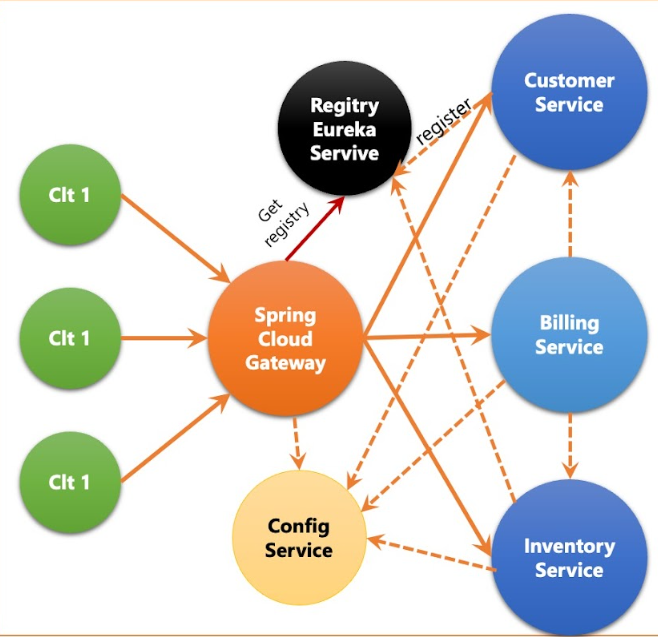
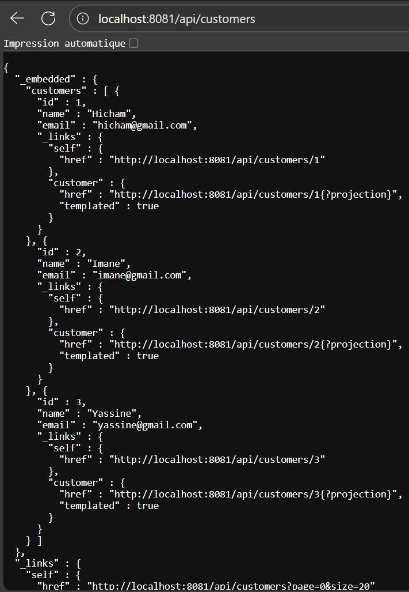
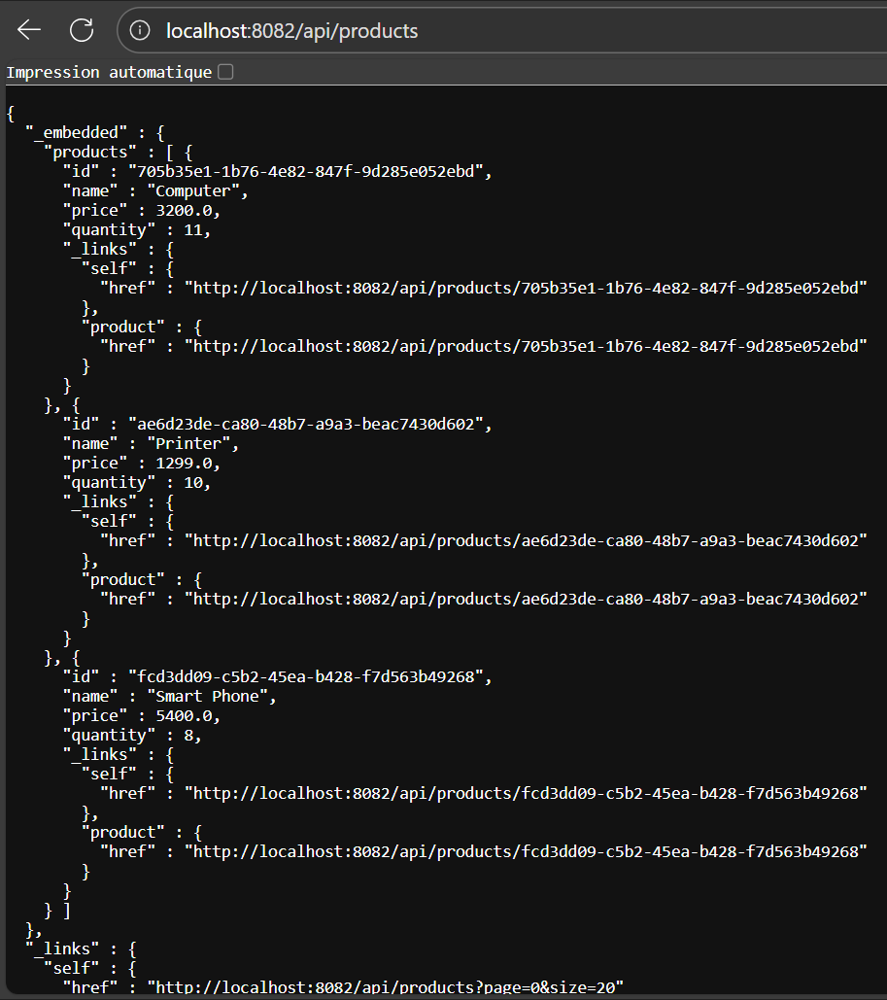
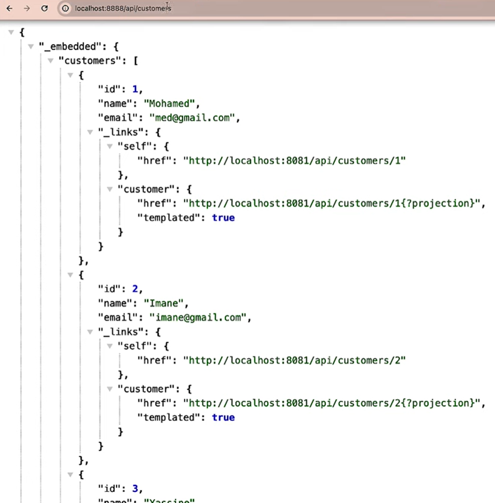
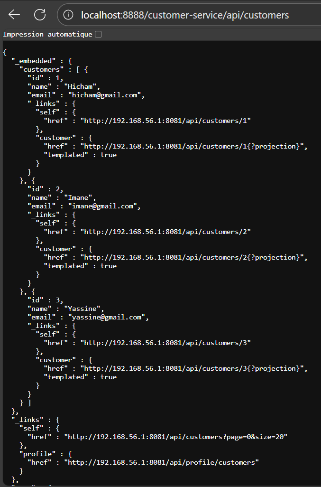
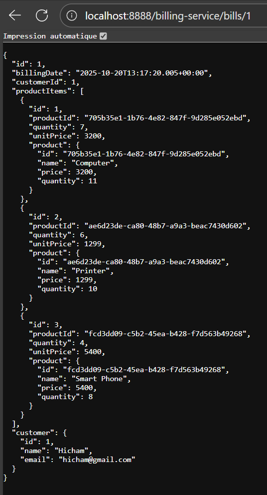
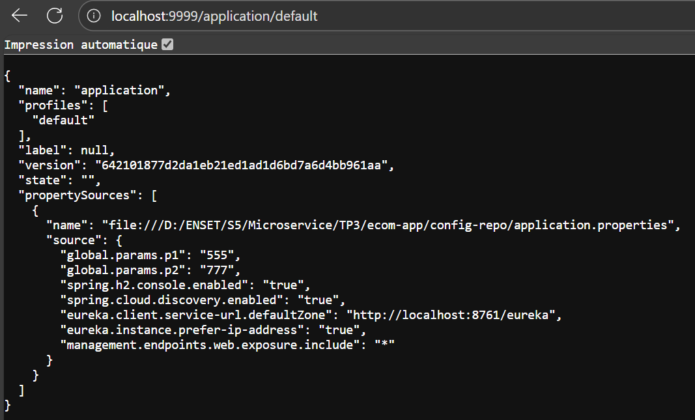

# 🧾 Microservices-Based Billing System

This project is a **Spring Cloud microservices architecture** that manages **invoices (factures)** containing **products** belonging to a **customer**.  
It demonstrates microservice communication, service discovery, routing, and centralized configuration.

---

## 🎯 Objective

Build a distributed system with independent microservices for:
- Customer management
- Product inventory
- Billing
- API Gateway
- Service Discovery
- Centralized configuration

---

## 🏗️ Architecture Overview

📷 *Global Architecture Diagram*  

📝 *Each service is independent, communicating via or OpenFeign, registered through Eureka, and routed via Spring Cloud Gateway.*

---

## ⚙️ Steps to Build the System

---

### **1️.  Customer Service**
Create the **Customer-Service** microservice to manage customer data (CRUD operations).

📷 *Customer Service endpoint*  

📝 *Handles client information like ID, name, and email.*

---

### **2️.  Inventory Service**
Create the **Inventory-Service** microservice to manage products and their stock quantities.

📷 *Inventory Service endpoint*  

📝 *Provides APIs to manage products (name, price, quantity).*

---

### **3. ️Static Routing Configuration**
Define static routes in the Gateway configuration file (e.g., `application.yml`) to connect services manually.

📷 *Static Routes for customers endpoint*  

📝 *Allows routing to predefined microservices using static URLs.*

---

### **4.  Eureka Discovery Service**
Set up **Eureka Discovery Service** to register and discover microservices dynamically.

📷 *Eureka Dashboard Example*  

📝 *Each microservice registers itself for dynamic discovery.*

---

### **5. Dynamic Routing via Gateway**
Enable dynamic routing in the Gateway using Eureka to automatically discover services.

📷 *Dynamic Routing Example*  

📝 *Removes the need for static configuration — routing is handled automatically.*

---

### **7️⃣ Billing Service (OpenFeign)**
Create the **Billing-Service** that:
- Manages invoices (factures)
- Calls **Customer-Service** and **Inventory-Service** via **OpenFeign** clients
- Associates each invoice with a customer and product list

📷 *Billing Service endpoint*  

📝 *Demonstrates inter-service communication using Feign clients.*

---

### **8️⃣ Configuration Service**
Set up a **Spring Cloud Config Server** to centralize configuration files for all microservices.

📷 *Config Server endpoint Example*  

📝 *Ensures consistent and centralized configuration management.*

---

## 🧩 Technologies Used

| Component | Technology                               |
|------------|------------------------------------------|
| Backend Framework | Spring Boot                              |
| API Gateway | Spring Cloud Reactive Gateway            |
| Service Discovery | Eureka Server                            |
| Configuration Management | Spring Cloud Config                      |
| Inter-Service Communication | OpenFeign                                |
| Database | H2                                       |
| Dependencies | Lombok, Spring Web, Spring Data JPA, ... |

---

## 📚 Final Architecture Recap

📝 *Client → Gateway → Eureka → Config Server → Microservices (Customer, Inventory, Billing).*
